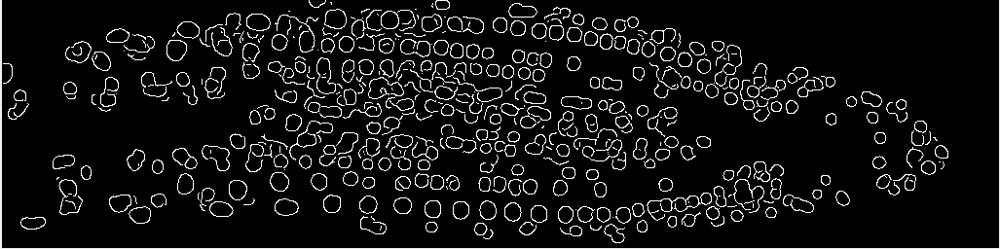
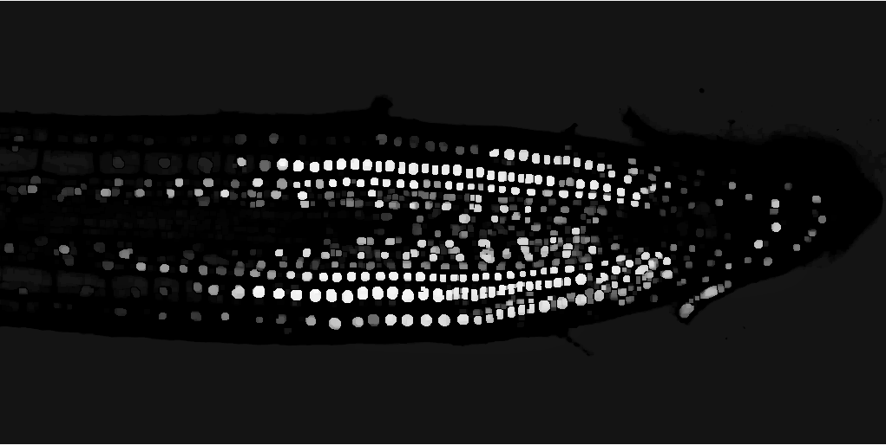
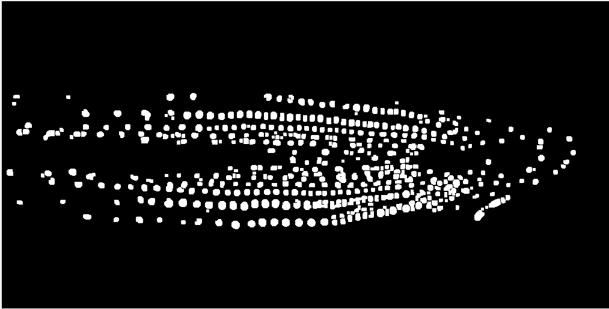

# IIP-Nuclei-Extraction

### Image Processing Project to Extract Nuclei from cross-section images of plants. Matlab code
---
## Quick Glimpse

This is a coursework project focusing on the processing of the images and retrieval of the individual nuclei as shown

### Running the Code

1. The images should be in the same folder as the .m code files

2. Make sure the extractNuclei.m file is also in the same folder

3。 Open the CW_testDriver.m i the Editor

4. For this CW, the code is separated into sections for different images. However, the function used to extract the nuclei is the same

5. To run the first image click on the first section and then click on Run Section at the Editor toolbar

6. It is the same for subsequent images. (However, you can run all at once by clicking Run, but it is not recommended)

7. The output should be a Binary Image showing the nuclei, a grayscale image and the original image comparison montage and 2
   histograms showing the distribution of the area and circularity of the nuclei

8. The Command Window should also show a table of the individual statistic of each nuclei counted (Area, Circularity, Perimeter).
   The total count is also displayed in the Command Window.
